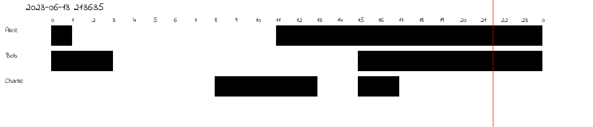
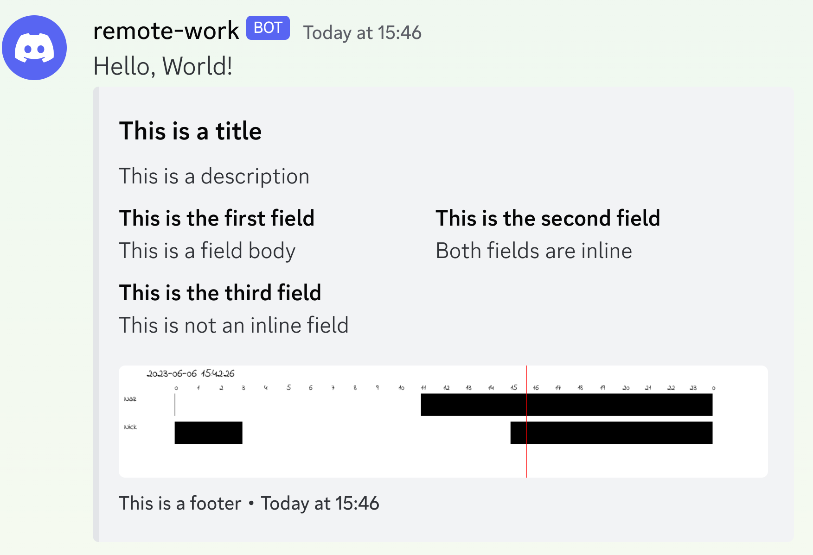

# Monotype Room Events Scheduling Bot

## What is this?

This library is intended to be used to visualise a Monotype's event hosts
Imagine you have a team of people working across different timezones. This tool
should enable you to:

- add team members via discord command along with their work intervals
- add team members' holidays via discord command
- visualize the team's work hours in a given day in caller's timezone in discord

Implementation does not have any of these features yet. Instead, it has a structure for:

- modeling remote team members (see `remote-work` workspace)
- visualizing the team's work hours in a given day in UTC timezone (see `visualizer` workspace)
- spawning up a discord bot that can post the image into the channel (see `discord` workspace)

This repository is mainly a learning experience in writing Rust for me, so expect the code to be terrible.

## Architecture

There are 3 workspaces in this repository.

`discord` - responsible for spawning up a bot and posting the time schedule
image into the channel in the timezone of the caller. The caller, I envisioned
would supply a UTC offset. Since all the team member's work intervals are
specified in a json file (see `team.example.json`) in the root of this repo, we
assume that these all are UTC times. As such, it's easier to have the bot take a
number as an input that signifies the offset from the UTC timezone. Note that I
did not have the time to complete this workspace. To run the discord bot run:

`DISCORD_TOKEN=<your bot token> cargo run -p remote_work_discord`

Then write `~message` and you will have the bot posting the following

`remote-work` - here we have the data structures that model the remote team.
These are `Member` and `Team` which is a vector of `Member`s. Each `Member` has
a vector of work intervals attached to them.

`visualizer` - this library is responsible for visualizing the data coming out
of `remote-work`. Right now, it only supports producing of one image only. Do

`cargo run -p remote_work_visualizer`

and it will produce something like:

## TODOs

- incorporate holidays so that person shows up as on a holiday when appropriate
- implement converting into caller's timezone (by supplying the offset)
- complete discord workspace
- ability to deploy the discord bot with Shuttle
- it's possible to easily add db with shuttle. This would make it easy to have
  discord commands operate on persistent data.

## Original Spec

I am interested in the following features:

- each person's expected working hours
- if today someone is on a holiday I can see it
- converting the times to your local timezone for whoever is initiating the
  command

Technical considerations

- simple, lightweight storage of the timezone and holiday data
- discord or other communication channel API separate from business logic
- visualization API separate from other parts of the API

Storage, Discord and so on I'd like to be handled by Rust crate that is
completely independent of this. The only purpose of this crate should be to
create different Team members, assign working timezones to them and have the
ability to have them propose holidays.
